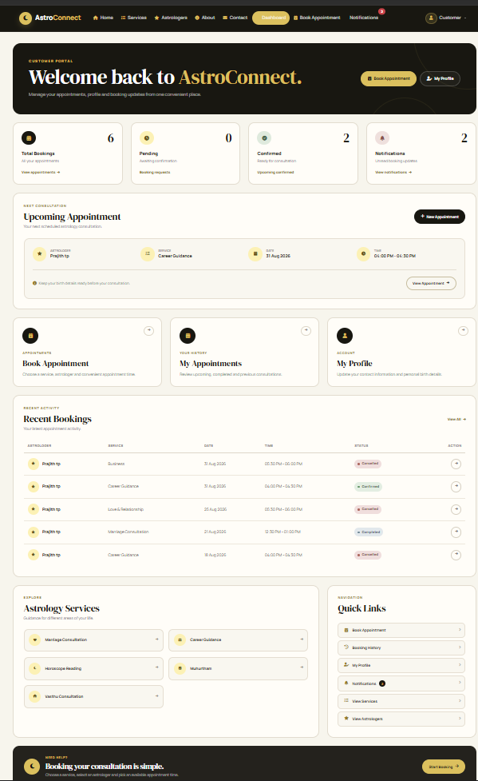
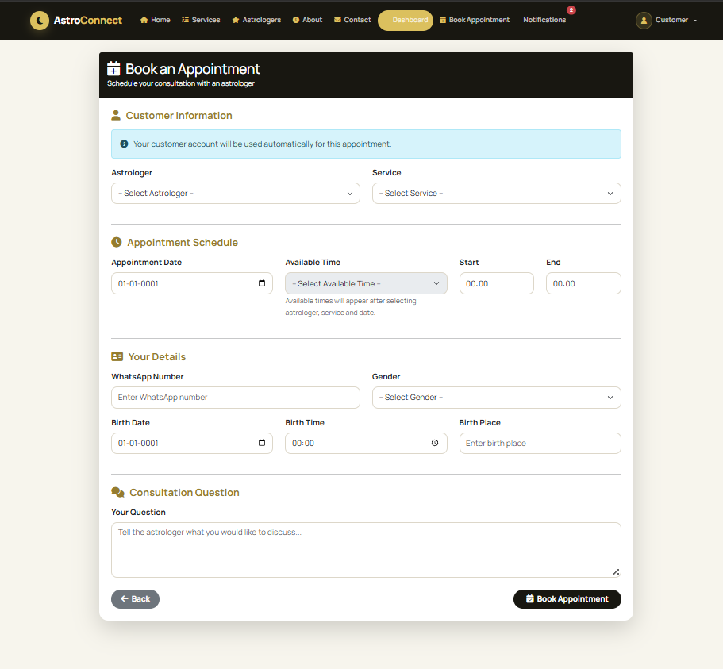
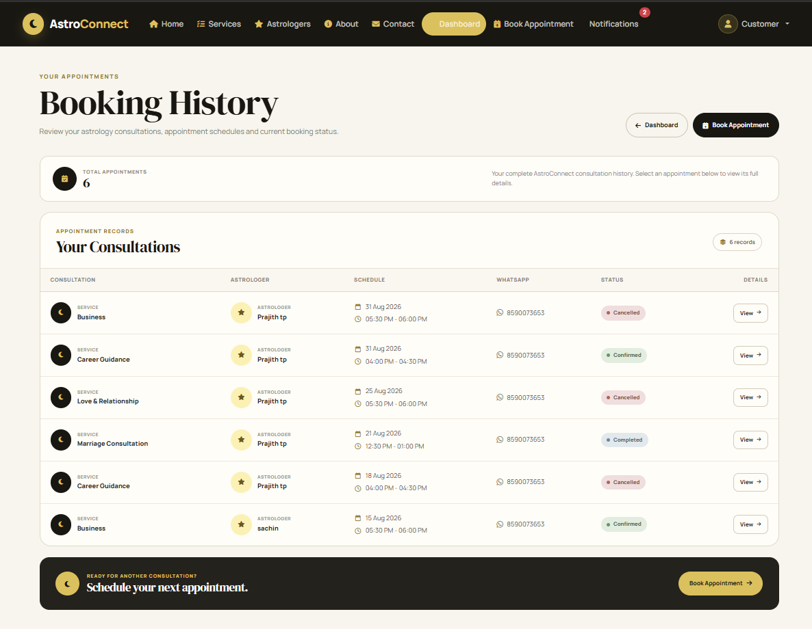
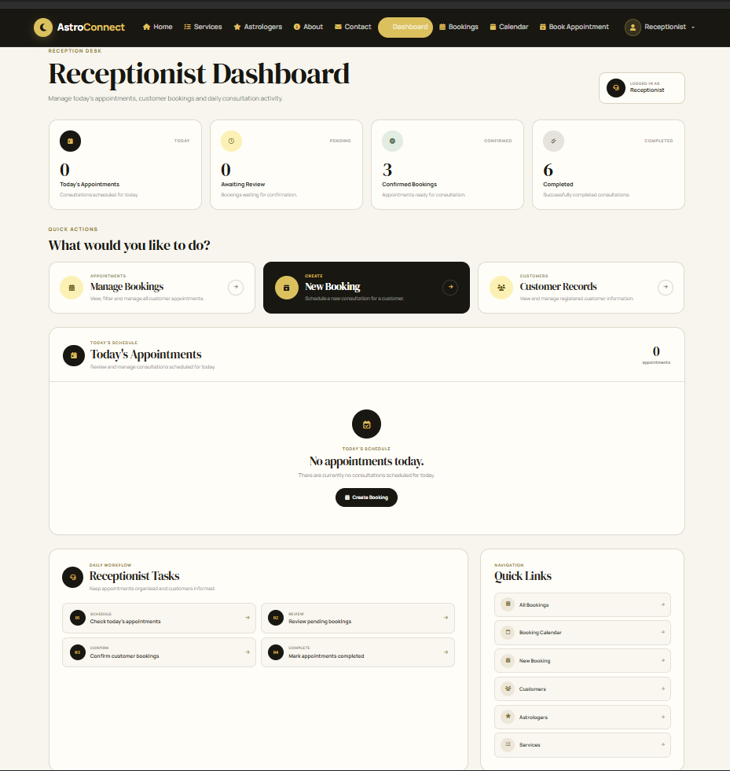
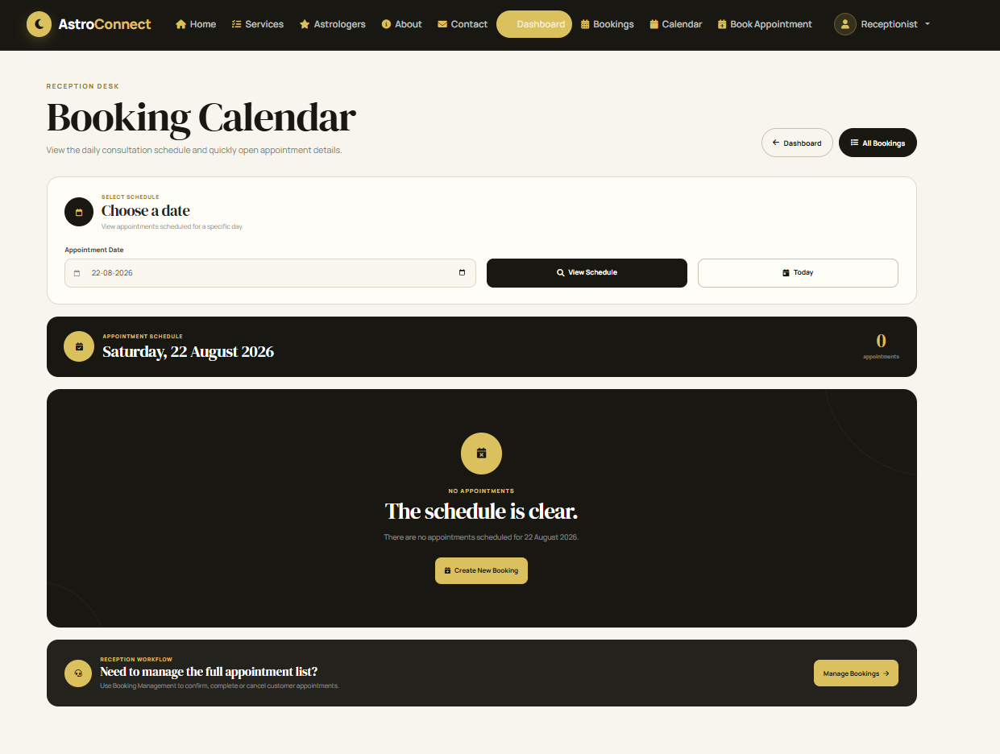
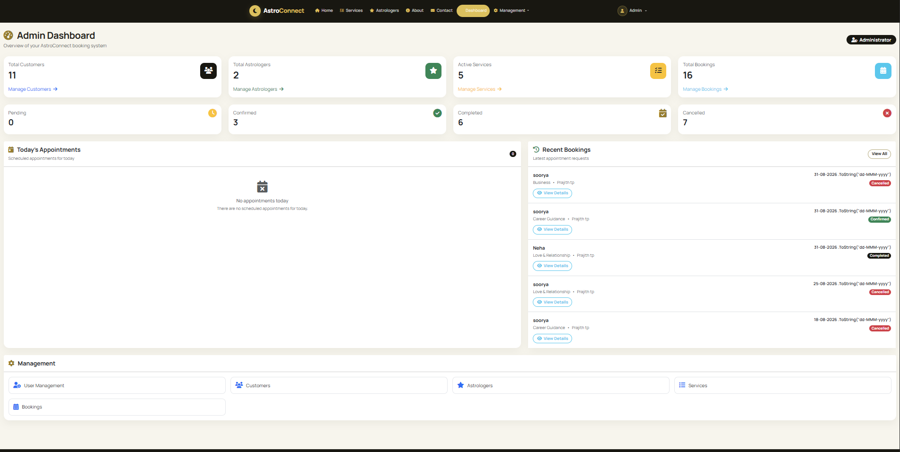

# 🔮 AstroConnect

AstroConnect is a role-based astrology appointment booking and management system built with **ASP.NET Core MVC**, **Entity Framework Core**, **SQL Server**, and **ASP.NET Core Identity**.

The application provides a complete workflow for customers to book astrology consultations while allowing receptionists and administrators to manage appointments, customers, services, astrologers, and users through dedicated portals.

---

## ✨ Features

### 👤 Customer Portal

- Customer registration and secure login
- Personal customer dashboard
- Create astrology consultation bookings
- Select service and astrologer
- Appointment date and time-slot selection
- Booking conflict prevention
- View booking history
- View booking details
- Cancel eligible appointments
- Manage customer profile
- Receive booking notifications
- Track appointment status

### 🧑‍💼 Receptionist Portal

- Dedicated receptionist dashboard
- View customer bookings
- View detailed booking information
- Confirm pending appointments
- Complete confirmed appointments
- Cancel eligible appointments
- Calendar-based booking view
- View customer information
- Booking status management

### 🛡️ Admin Portal

- Administrative dashboard
- User management
- Role management
- Service management
- Astrologer management
- Customer management
- Booking management
- Booking status control
- Protected Admin-only management endpoints

---

## 📅 Booking Workflow

AstroConnect supports a structured appointment lifecycle:

```text
Customer creates booking
        ↓
      Pending
        ↓
Receptionist/Admin confirms
        ↓
     Confirmed
        ↓
Consultation takes place
        ↓
     Completed
```

Bookings can also be cancelled when permitted.

The system validates appointment dates and times and prevents conflicting bookings for the same astrologer.

---

## 🕒 Appointment Rules

The booking system includes server-side validation for:

- Valid booking dates
- Start and end times
- 30-minute appointment duration
- Business hours
- 30-minute time-slot alignment
- Past-date prevention
- Same-day past-time prevention
- Active services
- Active astrologers
- Booking conflict prevention

---

## 🧰 Technology Stack

### Backend

- C#
- ASP.NET Core MVC
- .NET
- Entity Framework Core
- ASP.NET Core Identity

### Frontend

- HTML5
- CSS3
- Bootstrap
- JavaScript
- Razor Views
- Font Awesome

### Database

- Microsoft SQL Server
- Entity Framework Core Migrations

### Development Tools

- Visual Studio 2022
- SQL Server Express
- Git
- GitHub

---

## 🏗️ Architecture

AstroConnect follows a layered **Clean Architecture** approach.

```text
AstroConnect
│
├── AstroConnect.Domain
│   ├── Entities
│   ├── Enums
│   └── Common
│
├── AstroConnect.Application
│   └── Interfaces
│       └── Repositories
│
├── AstroConnect.Persistence
│   ├── Context
│   ├── Identity
│   ├── Migrations
│   └── Repositories
│
└── AstroConnect.Web
    ├── Controllers
    ├── ViewModels
    ├── Views
    └── wwwroot
```

This separates business/domain models, application contracts, data access, Identity, and presentation concerns.

---

## 👥 User Roles

AstroConnect uses role-based authorization with three primary roles.

| Role | Main Responsibilities |
|------|------------------------|
| Admin | Manages users, services, astrologers, customers and bookings |
| Receptionist | Manages appointment workflow and views customer information |
| Customer | Creates bookings, manages profile and tracks appointments |

Sensitive management actions are protected using ASP.NET Core role-based authorization.

---

## 🔐 Security

The application includes several security measures:

- ASP.NET Core Identity authentication
- Role-based authorization
- Admin-only management endpoints
- Customer-specific resource authorization
- Anti-forgery validation on POST operations
- Account lockout protection
- Unique email configuration
- Secure password handling through ASP.NET Core Identity
- Production HSTS support
- Production exception handling
- Development configuration excluded from Git
- No database passwords stored in the repository

---

## 🗃️ Database

The application uses **SQL Server** with **Entity Framework Core Code First migrations**.

Main entities include:

- Customer
- Astrologer
- Service
- Booking
- Notification
- ApplicationUser

Soft deletion is used for important business records where applicable.

---

## 🚀 Getting Started

### Prerequisites

Install:

- .NET SDK
- Visual Studio 2022 or another compatible IDE
- SQL Server / SQL Server Express
- Entity Framework Core CLI tools

---

### 1. Clone the Repository

```bash
git clone <your-repository-url>
cd AstroConnect
```

---

### 2. Configure the Development Database

The repository intentionally does not include the local `appsettings.Development.json`.

Create:

```text
AstroConnect.Web/appsettings.Development.json
```

Example:

```json
{
  "ConnectionStrings": {
    "DefaultConnection": "Server=YOUR_SERVER;Database=AstroConnectDb;Trusted_Connection=True;TrustServerCertificate=True;"
  }
}
```

Replace `YOUR_SERVER` with your SQL Server instance.

> Do not commit credentials or production connection strings to GitHub.

---

### 3. Apply Database Migrations

From the solution directory:

```bash
dotnet ef database update --project AstroConnect.Persistence --startup-project AstroConnect.Web
```

---

### 4. Run the Application

```bash
dotnet run --project AstroConnect.Web
```

Open the local URL displayed in the terminal.

---

## 📸 Screenshots

### Customer Dashboard



### Create Booking



### Booking History



### Receptionist Dashboard



### Receptionist Calendar



### Admin Dashboard



---

## 📱 Responsive Design

AstroConnect provides a responsive interface designed for:

- Desktop
- Tablet
- Mobile

Bootstrap and custom responsive styling are used throughout the Customer, Receptionist, and Admin portals.

---

## 🧪 Validation & Reliability

The application includes:

- Server-side model validation
- Booking conflict validation
- Appointment time validation
- Role and authorization checks
- Customer ownership checks
- Soft deletion
- EF Core migration management
- Central production exception handling

---

## 🔮 Future Improvements

Potential future enhancements include:

- Online payment integration
- Email notifications
- WhatsApp notifications
- Additional astrologers
- Advanced appointment scheduling
- Customer reviews and ratings
- Reports and analytics
- Cloud deployment
- Automated testing

---

## 📄 Project Status

AstroConnect is currently in the final testing and deployment-preparation stage.

Core booking functionality, role-based portals, security hardening, responsive UI, database migrations, and appointment lifecycle management are implemented.

---

## 👨‍💻 Developer

Developed as a full-stack ASP.NET Core MVC project demonstrating:

- Clean Architecture
- ASP.NET Core MVC
- Entity Framework Core
- SQL Server
- ASP.NET Core Identity
- Repository Pattern
- Role-Based Authorization
- Responsive Web Development

---

## 📜 License

This project is intended for educational and portfolio purposes.